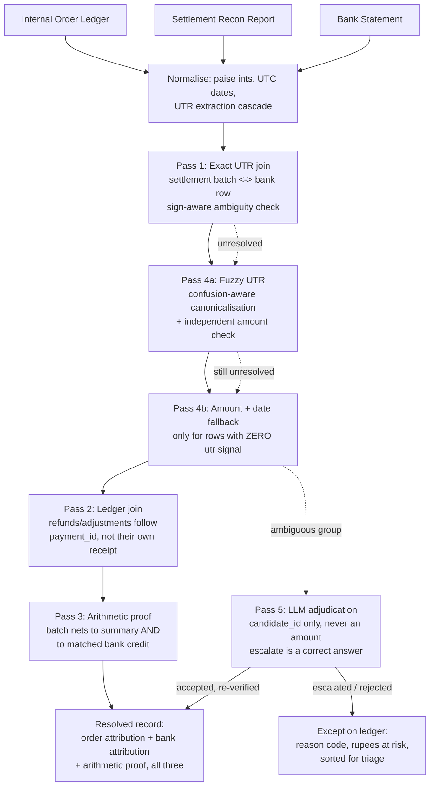

# Architecture

## Pipeline

## Design decisions

**Deterministic code decides; the LLM only proposes, explains, and
scores.** Concretely: the LLM's response schema has no field for an
amount — it can only choose a `candidate_id` from a list our code
supplies, and that ID is checked against the offered list before being
trusted. Every accepted proposal is independently re-verified
arithmetically by our own code, never taken on the model's word.

**Order attribution and bank attribution are tracked as two independent
questions**, not collapsed into one status. A settlement can have perfect
order attribution (we know exactly which internal orders it contains) while
its bank attribution is genuinely ambiguous (we can't tell which of two
identical-amount bank credits is "the" one) — these are different
questions with different correct answers, and conflating them would either
wrongly penalize a correct order-level match or wrongly excuse a real
bank-level exception.

**Ground truth encodes only what's actually knowable from the data**, not
what the generator happens to remember about its own construction. For the
genuinely ambiguous case, ground truth deliberately omits a definite
`bank_txn_id` — a matcher that correctly declines to guess should not be
scored as wrong for failing to reproduce information nobody could actually
derive from the inputs.

## Rejected / not-built alternatives

**Subset-sum reconstruction for orphan bank credits.** The original plan
(see the project roadmap) called for a subset-sum pass to reconstruct
which set of orders composes a bank credit when no clean grouping exists.
Not built: this dataset's actual settlement schema groups every
constituent line under an explicit `settlement_id` before it ever reaches
the bank side, so the "which orders sum to this credit" reconstruction
problem never actually arises — the many-to-one relationship is resolved
by the schema itself, not by search. Worth revisiting only if a future
data source lacks that explicit batch grouping.

**Trusting `order_receipt` directly on refund/adjustment lines.** The
generator happens to populate this field correctly on every line, which
would have made Pass 2 a trivial dict lookup if built naively. Built
instead to follow `payment_id` back to the original payment first — the
field real Razorpay refund records are documented to reliably carry — and
only fall back to the line's own `order_receipt` if that chain fails.
Verified with a test that deletes `order_receipt` entirely from a
synthetic refund line and confirms resolution still succeeds via the
`payment_id` chain alone.

**A fixed size threshold for the ambiguous-duplicate anomaly's candidate
batches.** Tried first: no size limit (one run swept a 102-line batch into
"ambiguous," 14% of all records). Tried second: a hardcoded "≤4 lines"
cutoff, which overcorrected to zero pairs ever firing, since this
dataset's batches average ~27 lines. Settled on a cutoff relative to each
run's own batch-size distribution (bottom quartile, smallest available)
— proportionate regardless of dataset scale. Full sequence in
`FAILURE_LOG.md`.

**Gemini's `usage_metadata` for cost tracking.** Assumed this would
populate real token counts, based on the field's presence in the SDK.
Its own docstring says otherwise ("not supported in Gemini API"), confirmed
by a real run showing 0/0 tokens on 5 successful calls. Replaced with a
text-length estimate for Gemini, clearly labeled as an estimate — Anthropic's
`Usage.input_tokens`/`output_tokens`, by contrast, are required fields and
verified to populate reliably.

**A single LLM call per ambiguous bank row, offered all remaining
candidates at once.** Considered asking the model to resolve an entire
N-vs-N ambiguous group in one shot. Built instead to process one bank row
at a time, shrinking the candidate pool as settlements get accepted —
makes each individual decision auditable on its own, and keeps the prompt
small regardless of group size.
